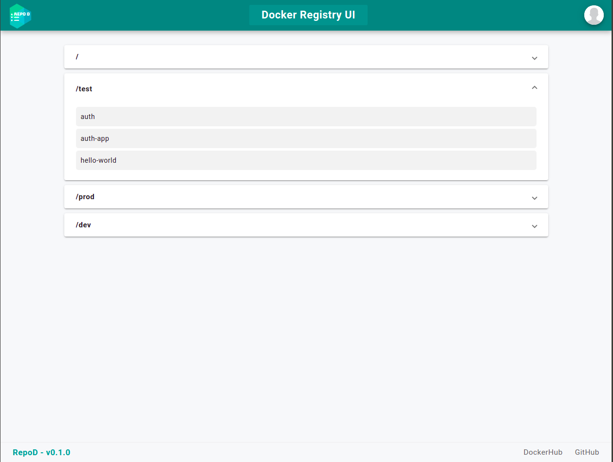

# RepoD - Docker Registry UI

[](https://github.com/betonr/repo-d/blob/master/LICENSE)
[](tidyverse.org/lifecycle/#experimental)
[](https://github.com/brazil-data-cube/portal/releases)

Web Interface created with FastAPI and Angular to list images from the docker registry. Allow the use of the docker registry integrated with OAuth2.0.


### **Features implemented**

1. Login and get token in OAuth 2.0
2. List Images of the repository (docker registry server)
3. List Tags by Images
4. Delete Image (if you want)




### **Install for development**

in development


### **Deploy**

1. Change environment variables in docker-compose:

    - API_SECRET_KEY = secret word used to encrypt the user's token in the session (e.g. YourS3cret0KEN)

    - API_ENABLE_DELETE_IMG = use to enable delete image function in the interface (default: false)

    - REGISTRY_URL = Docker registry URL (e.g. https://localhost:5000)

    - OAUTH_URL = OAuth2.0 URL that is integrated with docker registry (e.g. https://localhost:5000/token)

    - FRONT_APP_NAME = Name of your docker registry App (default: Docker Registry UI)

2. Running

```bash
    docker-compose up -d
```


